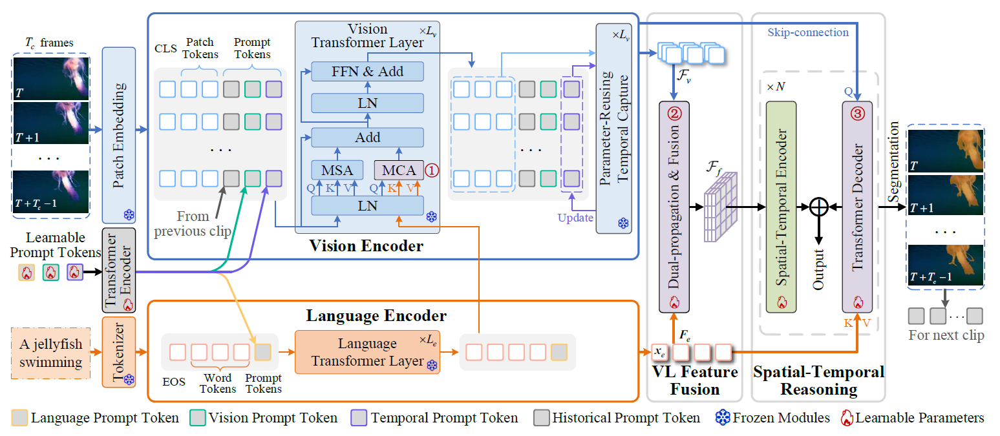

# VLP-RVOS

The official implementation of the paper: 

<div align="center">
<h1>
<b>
Harnessing Vision-Language Pretrained Models with Temporal-Aware Adaptation for Referring Video Object Segmentation
</b>
</h1>
</div>


<p align="center"></p>

## Introduction

We introduce a framework named VLP-RVOS which harnesses VLP models for RVOS through temporal-aware adaptation. We first propose a temporal-aware prompt-tuning method, which not only adapts pretrained representations for pixellevel prediction but also empowers the vision encoder to model temporal contexts. We further customize a cube-frame attention mechanism for robust spatial-temporal reasoning. Besides, we propose to perform multi-stage VL relation modeling while and after feature extraction for comprehensive VL understanding. Extensive experiments demonstrate that our method performs favorably against state-of-the-art algorithms and exhibits strong generalization abilities.

# Installation

## Setup

The main setup of our code follows [Referformer](https://github.com/wjn922/ReferFormer).

First, clone the repository locally.

```
git clone https://github.com/xwt909090/VLP-RVOS
```

Then, install Pytorch==1.11.0 (CUDA 11.3) torchvision==0.12.0 and the necessary packages as well as pycocotools.
```
pip install -r requirements.txt 
```

Finally, compile CUDA operators.
```
cd models/ops
python setup.py build install
cd ../..
```

Please refer to [Referformer](https://github.com/wjn922/ReferFormer) for data preparation.

## Training and Evaluation

All the models are trained using 4 RTX 3090 GPU. 

If you want to train/evaluate VLP-RVOS, please run the following command:

```
python -m torch.distributed.launch --nproc_per_node=4 --master_port=29500 --use_env train.py --experiment_name=clip-base
```

```
python test.py --test_start=11 --test_end=11 --ngpu=4 --experiment_name=clip-base
```

Note: You can modify the `--experiment_name` and to specify a config file.

## Acknowledgements

- [Deformable DETR](https://github.com/fundamentalvision/Deformable-DETR)
- [ReferFormer](https://github.com/wjn922/ReferFormer)
- [MTTR](https://github.com/mttr2021/MTTR)

## Contact
If you have any questions about this project, please to ask.
